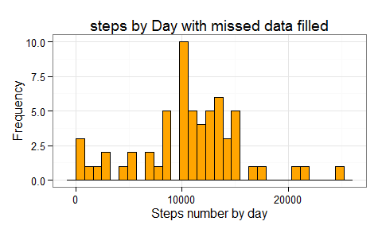

# Reproducible Research: Peer Assessment 1

Hugo Andrés Dorado B.


## Loading and preprocessing the data

The database is read and the date is converted to a the date formate. We need plyr to process the database and ggplot2 to create the graphics.


```r
library(plyr)
library(ggplot2)

dataSet <- read.csv("activity.csv")

dataSet$date <- as.Date(dataSet$date)
```


## What is mean total number of steps taken per day?

The rows with NA values were removed and the total steps by day were estimated. A histogram is shown for study the distribution of steps by day .


```r
TidydataSet <- dataSet[complete.cases(dataSet),]

stepsByDay <- ddply(TidydataSet,~date,summarise,stepByDay = sum(steps))
```


```r
png("figure/stepsByDay.png",height =300 ,width =485 )
print(ggplot(stepsByDay,aes(x=stepByDay))+geom_histogram(colour = "black", fill =
        "orange")+theme_bw()+ylab("Frequency")+xlab("Steps number by day")+
  ggtitle("Steps by day"))
dev.off()
```


```
## stat_bin: binwidth defaulted to range/30. Use 'binwidth = x' to adjust this.
```


```r
data.frame(Mesure=c("mean","median"),Value=c(mean(stepsByDay$stepByDay),median(stepsByDay$stepByDay)) )
```

```
##   Mesure    Value
## 1   mean 10766.19
## 2 median 10765.00
```
The mean of total number of steps taken per day is 10766.19 and the median is 10765.00.

## What is the average daily activity pattern?

```r
intervSteps <- ddply(TidydataSet,~interval,summarise,stepMean=mean(steps))
```


```r
intervSteps[which(intervSteps$stepMean == max(intervSteps$stepMean)),]
```

```
##     interval stepMean
## 104      835 206.1698
```
The maximum number of steps is in average 206.1698 given in the interval 835.

The pattern shown low steps in the first interval, the highest between the interval 800 -900 and decay after with a estational variation.

## Imputing missing values


```r
table(!complete.cases(dataSet))
```

```
## 
## FALSE  TRUE 
## 15264  2304
```

The dataset have rows with 2304 NAs

The NA´s value were filled using the means of the steps of 5 minute interval, then the table generated `intervSteps` before is used.


```r
fillNa <- merge(dataSet[is.na(dataSet$steps),],intervSteps,by.x="interval",by.y= "interval",sort = F )

dataSet$steps[is.na(dataSet$steps)] <- fillNa$stepMean
```
A new dataset that is equal to the original dataset but with the missing data filled was created


```r
stepsByDayFill <- ddply(dataSet,~date,summarise,stepByDay = sum(steps))
```


```r
png("figure/stepsByDayDataFilled.png",height =300 ,width =485 )
ggplot(stepsByDayFill,aes(x=stepByDay))+geom_histogram(colour = "black", fill =
                                                     "orange")+theme_bw()+ylab("Frequency")+xlab("Steps number by day")+
  ggtitle("steps by Day with missed data filled")
dev.off()
```


```
## stat_bin: binwidth defaulted to range/30. Use 'binwidth = x' to adjust this.
```




```r
data.frame(Mesure=c("mean","median"),Value=c(mean(stepsByDayFill$stepByDay),median(stepsByDayFill$stepByDay)) )
```

```
##   Mesure    Value
## 1   mean 10766.19
## 2 median 11015.00
```


We didn't found difference when the mean was estimated, however the medians are different. Now there were more variation between those statistics. The imputation increased the steps number in intervals with many NA values, because before was considered as 0 when the accumulated was computed, after the inputation they have positive values.

## Are there differences in activity patterns between weekdays and weekends?

A new factor variable in the dataset with two levels - "weekday" and "weekend" is created


```r
dataSet$week <- "weekday"

dataSet$week[weekdays(dataSet$date) %in% c("sábado","domingo")] <- "weekend"

weekSteps <- ddply(dataSet,~interval+week,summarise,stepMean = mean(steps))
```

```r
png("figure/stepsByIntervalWeekDays.png",height =550 ,width =485 )
print(ggplot(weekSteps,aes(x=interval,y=stepMean))+geom_line()+theme_bw()+
  facet_grid(week~.)+ylab("Number of steps"))
dev.off()
```


We see some differences for example in weeks there is a clear peak around the interval 800-900. After, the mean decreased. Is possible see that the number of steps begin earlier in weeks. On the other hand on weekend the mean of steps is maintained between 700 to 2000, with a variable behavior in some intervals.
